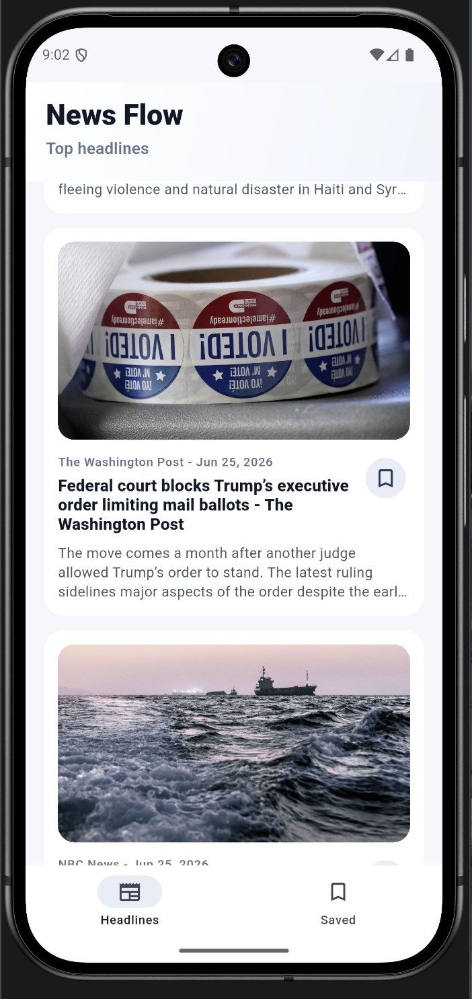
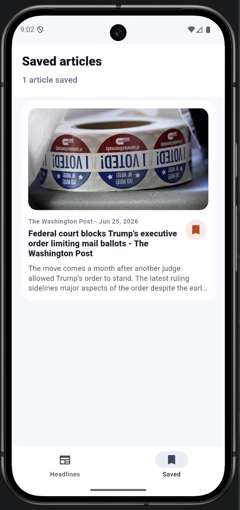

# News Flow

A Flutter mobile app that fetches news articles from NewsAPI, lets users browse the latest headlines, save favorite articles, and open full articles in the browser.

## Screenshots

|  |  |
| --- | --- |
| **iOS News**<br> | **iOS Saved**<br> |
| **Android News**<br> | **Android Saved**<br> |

## Overview

News Flow is a Flutter news app for Android and iOS. It demonstrates API integration, local favorites persistence, external browser navigation, and a clean mobile-first UI.

The app is designed as a portfolio project to show practical Flutter development skills, including working with REST APIs, managing local state, storing user preferences, and handling mobile platform configuration.

Package name: `flutter_news`

## Features

* Fetch latest news articles from NewsAPI
* Browse article cards with title, source, description, and image when available
* Save and remove favorite articles
* View saved articles in a dedicated Favorites tab
* Open full articles in the external browser
* Persist favorites locally using `shared_preferences`
* Android internet permission configured
* URL launching configured for supported platforms
* App icon configured with `flutter_launcher_icons`

## Tech Stack

* Flutter
* Dart
* NewsAPI
* `http`
* `shared_preferences`
* `url_launcher`
* `flutter_launcher_icons`
* Android Studio / VS Code

## Requirements

* Flutter SDK 3.0.0 or higher
* Dart SDK included with Flutter
* Android Studio or VS Code
* Android Emulator or iOS Simulator
* Personal NewsAPI key

## Setup Instructions

1. Clone the repository:

```bash
git clone https://github.com/cristianmarcu/Flutter_News.git
cd Flutter_News
```

2. Install dependencies:

```bash
flutter pub get
```

3. Run the app with your own NewsAPI key.

The app reads the key at build time with `String.fromEnvironment('NEWS_API_KEY')`. Do not edit source files with a real key, and do not commit API keys to GitHub.

```bash
flutter run --dart-define=NEWS_API_KEY=YOUR_NEWS_API_KEY
```

Android emulator:

```bash
flutter run -d <android-device-id> --dart-define=NEWS_API_KEY=YOUR_NEWS_API_KEY
```

iOS simulator:

```bash
flutter run -d <ios-simulator-id> --dart-define=NEWS_API_KEY=YOUR_NEWS_API_KEY
```

Debug builds:

```bash
flutter build apk --debug --dart-define=NEWS_API_KEY=YOUR_NEWS_API_KEY
flutter build ios --debug --simulator --dart-define=NEWS_API_KEY=YOUR_NEWS_API_KEY
```

## Expected Behavior

* The app loads news articles from NewsAPI.
* If `NEWS_API_KEY` is missing or invalid, the app shows a clear error message.
* Failed requests can be retried when retrying is useful.
* An empty NewsAPI response shows an empty state.
* Users can save articles as favorites.
* The Favorites tab displays saved articles.
* Favorite articles show a selected heart icon.
* Tapping an article opens it in the browser.

## Project Notes

* `url_launcher` is used to open articles externally.
* `shared_preferences` is used to persist favorite articles locally.
* `flutter_launcher_icons` is used for the app icon.
* NewsAPI requests pass the API key with the `X-Api-Key` HTTP header.
* `AndroidManifest.xml` includes internet permission and URL-launching queries.
* Async operations include mounted checks where needed.

## Security Note

This project requires a NewsAPI key. API keys should not be committed to the repository or written directly in public documentation.

If an API key was previously exposed publicly, treat it as compromised, revoke it, and replace it with a new one.

## Runtime Testing

Use a real NewsAPI key for successful API tests, but never commit it.

```bash
flutter run -d <android-device-id> --dart-define=NEWS_API_KEY=YOUR_NEWS_API_KEY
flutter run -d <ios-simulator-id> --dart-define=NEWS_API_KEY=YOUR_NEWS_API_KEY
```

Also verify:

* Missing key: `flutter run`
* Invalid key: `flutter run --dart-define=NEWS_API_KEY=INVALID_KEY`
* No internet or failed request: disable network access in the simulator/emulator and retry loading news

## Future Improvements

* Add in-app article detail screen
* Add article search
* Add category filters
* Add offline article caching
* Add loading skeletons
* Add unit tests for favorites logic
* Add UI tests for article and favorites flows

## Portfolio Focus

This project demonstrates:

* Runtime API key injection with `--dart-define=NEWS_API_KEY=...`
* Android and iOS mobile support
* Local favorites stored with `shared_preferences`
* Loading, error, retry, and empty states
* Clean, recruiter-friendly mobile UI
